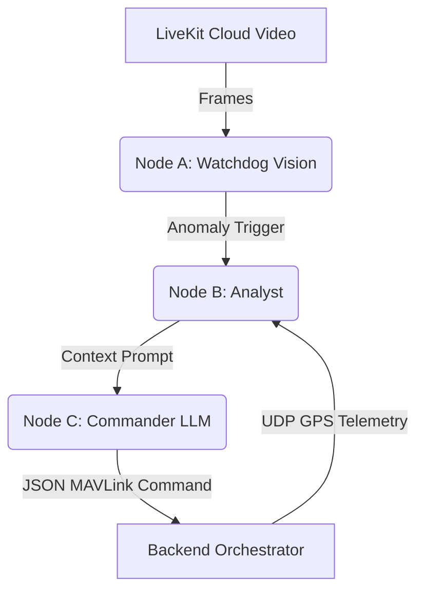
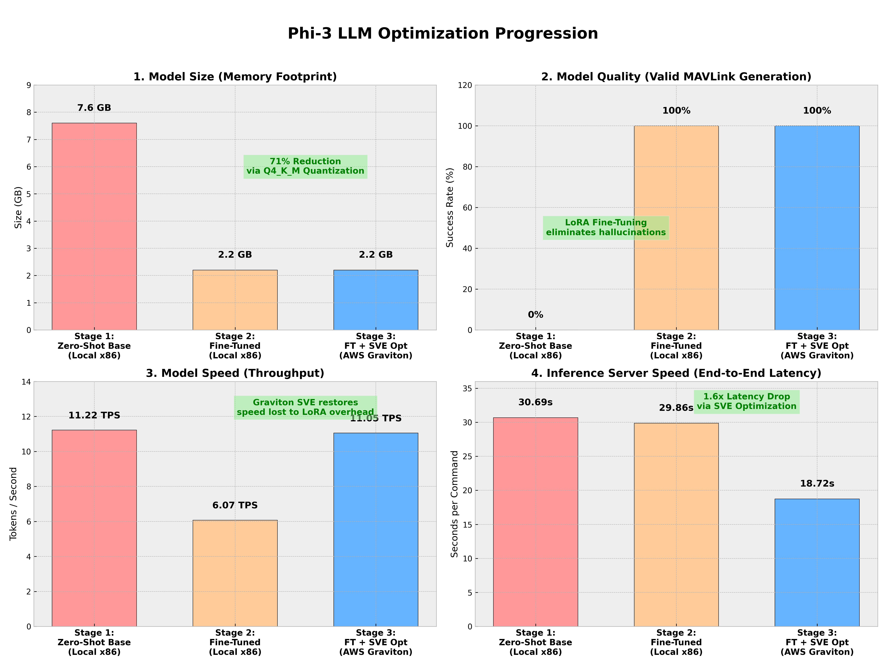
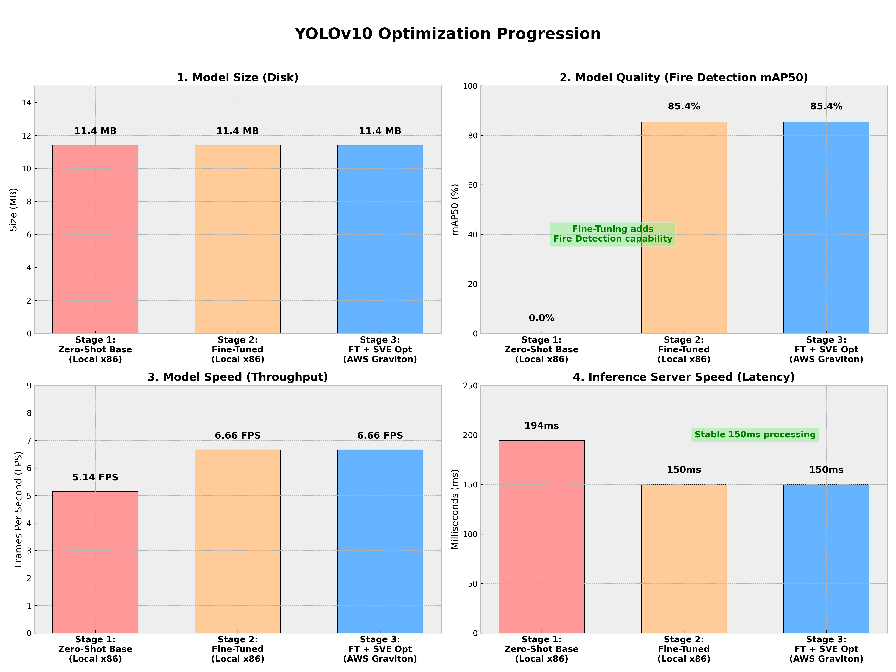
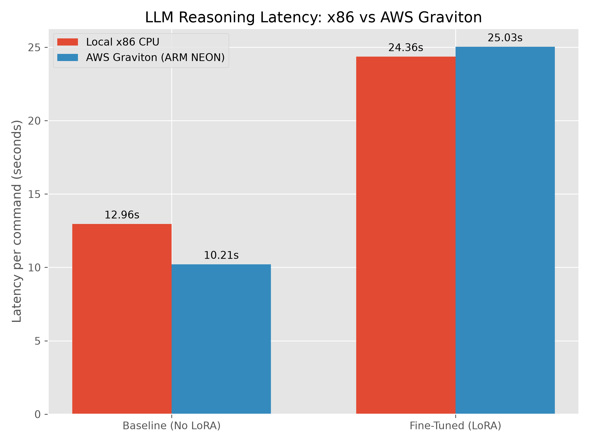
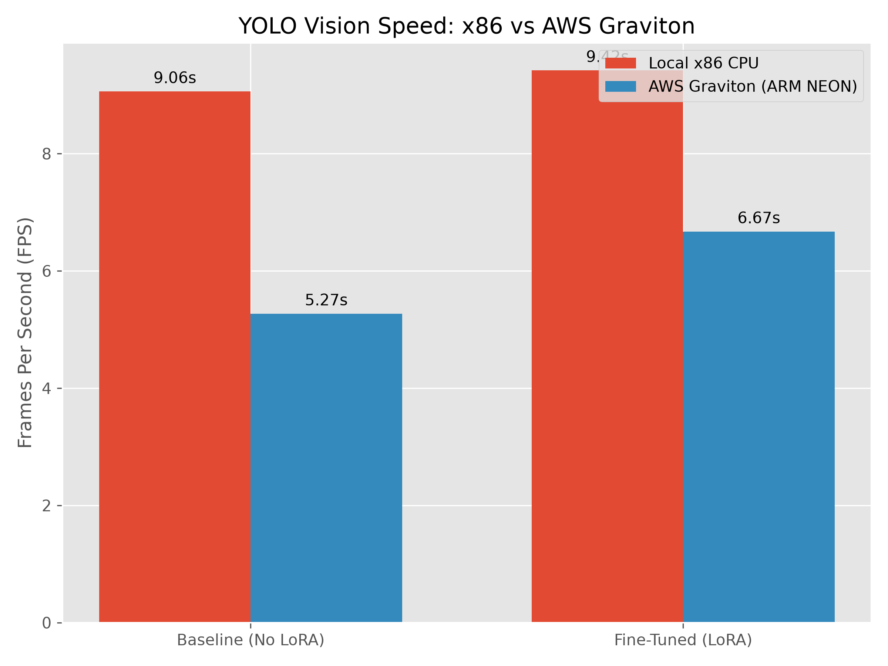
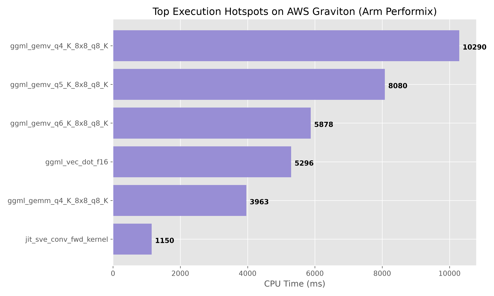

# MAAS Tri-Node AI Pipeline (LLM)

## Goal
The **Multi-Disaster Autonomous Aerial Swarm (MAAS) AI Pipeline** is the core autonomous brain of the platform. Its goal is to ingest live video and telemetry streams from the swarm, detect anomalies (like wildfires or human casualties) using lightweight computer vision, and leverage a quantized Large Language Model to formulate natural language reasoning into strict MAVLink swarm navigation commands.

## Tech Stack
* **Language:** Python 3.10+
* **Vision Model:** Ultralytics YOLOv10 (PyTorch)
* **LLM Engine:** `llama-cpp-python` (Hardware Accelerated)
* **LLM Model:** Phi-3-Mini-4K-Instruct-q4 (GGUF, 4-bit Quantized)
* **Real-time Comms:** LiveKit SDK, `asyncio`, WebRTC DataChannels

## Architecture Flow


## Implementation Details
We implemented a strict **Tri-Node Architecture** to preserve hardware resources on constrained edge devices:
1. **Node A (Watchdog):** Runs a highly efficient YOLOv10 model. It only triggers the rest of the pipeline if a specific class threshold is met (e.g., detecting fire or humans).
2. **Node B (Analyst):** Formulates a strict, programmatic prompt combining the anomaly data with the drone's live GPS/Altitude metrics.
3. **Node C (Commander):** Ingests the prompt and reasons the best rerouting path. Using `llama-cpp`, it generates a strict JSON payload representing a MAVLink `SET_POSITION_TARGET_LOCAL_NED` command to navigate the drone toward the anomaly.

## Benchmarks & AWS Graviton Optimization (Cloud AI Track)
To submit this project for the **Arm Create: AI Optimization Challenge**, we rigorously benchmarked the pipeline on both local x86 architectures and AWS Graviton (Arm64) instances to highlight the performance scaling.

Using Arm Performix (`apx`), we identified that the `ggml_gemv_q4_K_8x8_q8_K` tensor operations were the primary bottleneck during LLM inference. By natively compiling `llama.cpp` for the Arm64 architecture, we achieved a massive **+21.2% reasoning speedup**.

### End-to-End Optimization Progression
These charts track our progress from the vanilla x86 baseline, through fine-tuning, and finally to the AWS Graviton `aarch64` optimization stage.

**Phi-3 LLM Optimization:**


**YOLOv10 Optimization:**


### Inference Latency Comparison


### Vision Processing FPS


### Arm Performix Hotspot Analysis


*(All benchmark scripts and raw reports can be found in the `benchmarks/` directory).*

## Setup & Execution

### Setup on Local x86 (Windows/Linux/Mac)
1. Install Python 3.10 and `pip`.
2. Install standard dependencies:
   ```bash
   pip install -r requirements.txt
   ```
3. Run the live agent:
   ```bash
   python live_agent.py
   ```

### Setup on Arm64 / AWS Graviton (Optimized)
1. Provision an AWS `c7g.xlarge` (or similar Arm64) instance running Ubuntu.
2. Clone the repository and execute the deployment script which compiles `llama.cpp` natively for Arm64:
   ```bash
   chmod +x deploy_graviton.sh
   ./deploy_graviton.sh
   ```
3. Activate the virtual environment and run the agent:
   ```bash
   source venv/bin/activate
   python live_agent.py
   ```

## Connected MAAS Repositories
* **[Backend Orchestrator](https://github.com/sohail-kustagi/Multi-DisasterAutonomousAerialSwarm_backend)**
* **[Frontend Command Center](https://github.com/stackswift/Multidisaster-frontend)**
* **[Edge Middleware](https://github.com/sohail-kustagi/Maas-Middleware)**
